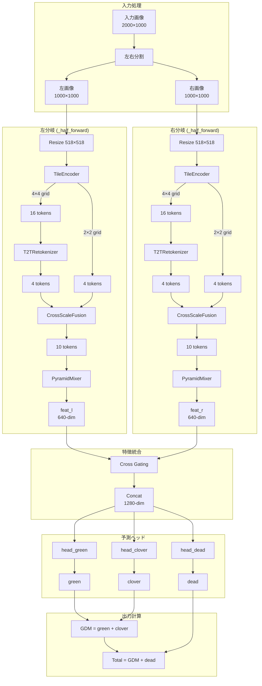
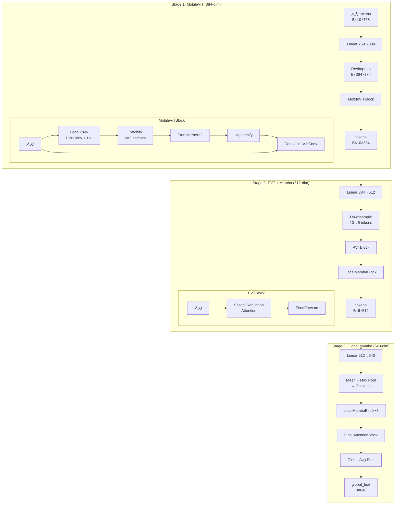

# LB 0.66 DINOv2 + Mamba + Multi-ViT アーキテクチャ詳細解説

このドキュメントは `notebook/lb-0-66-dino-v2-backbone-mamba-multi-vit.ipynb` の内容を詳細に解説します。

---

## 目次

1. [概要](#概要)
2. [全体アーキテクチャ](#全体アーキテクチャ)
3. [入力データの前処理](#入力データの前処理)
4. [モデルコンポーネント詳細](#モデルコンポーネント詳細)
   - [DINOv2 Backbone](#dinov2-backbone)
   - [TileEncoder](#tileencoder)
   - [T2TRetokenizer](#t2tretokenizer)
   - [CrossScaleFusion](#crossscalefusion)
   - [PyramidMixer](#pyramidmixer)
   - [出力ヘッド](#出力ヘッド)
5. [アーキテクチャ図](#アーキテクチャ図)
6. [設定パラメータ](#設定パラメータ)
7. [推論パイプライン](#推論パイプライン)
8. [テンソルの流れ（具体的な次元）](#テンソルの流れ具体的な次元)

---

## 概要

### モデル名

**CrossPVT_T2T_MambaDINO**

### 主要な特徴

- **マルチスケール処理**: 画像を異なるグリッドサイズ（4x4と2x2）で分割し、階層的に特徴を抽出
- **DINOv2 Backbone**: 自己教師あり学習済みのViTモデルをタイルエンコーダとして使用
- **Token-to-Token (T2T)**: 小グリッドのトークンを再トークン化して情報を圧縮
- **Cross-Scale Fusion**: 異なるスケールの特徴をクロスアテンションで融合
- **Pyramid構造**: MobileViT → PVT → Mamba の3段階で特徴を処理
- **左右分割処理**: 入力画像を左右に分割し、独立して処理後にゲーティングで統合

### 予測対象

| ターゲット | 予測方法 | 重み |
|-----------|---------|------|
| Dry_Total_g | 直接予測 | 0.5 |
| GDM_g | 直接予測 | 0.2 |
| Dry_Green_g | 直接予測 | 0.1 |
| Dry_Dead_g | 導出: `Dry_Total_g - GDM_g` | 0.1 |
| Dry_Clover_g | 導出: `GDM_g - Dry_Green_g` | 0.1 |

---

## 全体アーキテクチャ

```
入力画像 (2000 x 1000)
        │
        ▼
   ┌────┴────┐
   │         │
 左半分    右半分
(1000x1000)(1000x1000)
   │         │
   ▼         ▼
┌──────────────────────────────────────────────────────────┐
│                    _half_forward (左右各々)                │
│  ┌─────────────────────────────────────────────────────┐ │
│  │                   TileEncoder                        │ │
│  │  ┌──────────────┐    ┌──────────────┐               │ │
│  │  │ 4x4 Grid     │    │ 2x2 Grid     │               │ │
│  │  │ (16 tiles)   │    │ (4 tiles)    │               │ │
│  │  └──────┬───────┘    └──────┬───────┘               │ │
│  │         │                   │                        │ │
│  │    DINOv2 x16          DINOv2 x4                    │ │
│  │         │                   │                        │ │
│  │         ▼                   │                        │ │
│  │  tiles_small (B,16,768)     │                        │ │
│  │         │                   │                        │ │
│  │         ▼                   ▼                        │ │
│  │  ┌─────────────┐     tiles_big (B,4,768)            │ │
│  │  │T2TRetokenizer│           │                        │ │
│  │  │(16→4 tokens)│           │                        │ │
│  │  └──────┬──────┘           │                        │ │
│  │         │                   │                        │ │
│  │         └───────┬───────────┘                        │ │
│  │                 ▼                                    │ │
│  │         ┌──────────────┐                            │ │
│  │         │CrossScaleFusion│                          │ │
│  │         │ (クロスアテンション) │                     │ │
│  │         └───────┬──────┘                            │ │
│  │                 ▼                                    │ │
│  │         fused (B, 10, 768)                          │ │
│  │                 │                                    │ │
│  │                 ▼                                    │ │
│  │         ┌──────────────┐                            │ │
│  │         │ PyramidMixer │                            │ │
│  │         │ Stage1: MobileViT (384)                   │ │
│  │         │ Stage2: PVT+Mamba (512)                   │ │
│  │         │ Stage3: Global Mamba (640)                │ │
│  │         └───────┬──────┘                            │ │
│  │                 ▼                                    │ │
│  │         feat (B, 640)                               │ │
│  └─────────────────────────────────────────────────────┘ │
└──────────────────────────────────────────────────────────┘
        │                                    │
        ▼                                    ▼
    feat_l (B, 640)                    feat_r (B, 640)
        │                                    │
        └───────────────┬────────────────────┘
                        ▼
              ┌─────────────────┐
              │  Cross Gating   │
              │  g_l = σ(W_l · f_r)
              │  g_r = σ(W_r · f_l)
              │  f_l = f_l * g_l
              │  f_r = f_r * g_r
              └────────┬────────┘
                       ▼
              concat: f (B, 1280)
                       │
         ┌─────────────┼─────────────┐
         ▼             ▼             ▼
    head_green    head_clover    head_dead
         │             │             │
         ▼             ▼             ▼
      green        clover         dead
         │             │             │
         └─────────────┼─────────────┘
                       ▼
              ┌──────────────┐
              │  出力計算     │
              │ gdm = green + clover
              │ total = gdm + dead
              └──────────────┘
```

---

## 入力データの前処理

### 画像の読み込みと分割

```python
# 元画像: 2000 x 1000 ピクセル
img = cv2.imread(path)  # BGR
img = cv2.cvtColor(img, cv2.COLOR_BGR2RGB)

# 左右分割
h, w, _ = img.shape  # 1000, 2000, 3
mid = w // 2  # 1000
left = img[:, :mid]   # (1000, 1000, 3)
right = img[:, mid:]  # (1000, 1000, 3)
```

### データ拡張 (Albumentations)

```python
transform = A.Compose([
    A.Resize(518, 518, interpolation=cv2.INTER_AREA),
    A.Normalize(mean=[0.485, 0.456, 0.406], std=[0.229, 0.224, 0.225]),
    ToTensorV2(),
])
```

### TTA (Test Time Augmentation)

| 変換名 | 説明 |
|--------|------|
| original | 元画像そのまま |
| hflip | 水平反転 |
| vflip | 垂直反転 |

---

## モデルコンポーネント詳細

### DINOv2 Backbone

**使用モデル**: `vit_base_patch14_dinov2` (timm)

| パラメータ | 値 |
|-----------|-----|
| パッチサイズ | 14x14 |
| 入力解像度 | 518x518 |
| 出力次元 | 768 |
| Global Pool | token |

```python
# 候補リスト（フォールバック用）
dino_candidates = (
    "vit_base_patch14_dinov2",
    "vit_base_patch14_reg4_dinov2",
    "vit_small_patch14_dinov2",
)
```

### TileEncoder

画像をグリッドに分割し、各タイルをDINOv2で個別にエンコード。

```
入力: x (B, 3, 518, 518)
グリッド: (r, c) = (4, 4) or (2, 2)

処理:
1. 画像をr×c個のタイルに分割
2. 各タイルを518×518にリサイズ
3. DINOv2でエンコード
4. 全タイルの特徴を結合

出力: feats (B, r*c, 768)
```

**小グリッド (4x4)**: 16タイル → (B, 16, 768)
**大グリッド (2x2)**: 4タイル → (B, 4, 768)

### T2TRetokenizer

Token-to-Token: 小グリッドの16トークンを2x2=4トークンに圧縮。

```
入力: tokens (B, 16, 768), grid_hw = (4, 4)

処理:
1. トークンを特徴マップに変換 (B, 768, 4, 4)
2. フラット化してシーケンスに (B, 16, 768)
3. AttentionBlockを2回適用
4. adaptive_avg_pool2d で (2, 2) に縮小
5. 再度フラット化 (B, 4, 768)

出力: retokens (B, 4, 768), stage1_map (B, 768, 4, 4)
```

**構成**:
- depth: 2 (AttentionBlockの数)
- heads: 4

### CrossScaleFusion

異なるスケールのトークン間でクロスアテンションを実行。

```
入力:
  tok_s: 小スケール (B, 4, 768) ← T2Tの出力
  tok_b: 大スケール (B, 4, 768) ← 大グリッドの出力

処理:
1. 各スケールにCLSトークンを追加
   tok_s: (B, 5, 768), tok_b: (B, 5, 768)

2. 各層で:
   a. 自己アテンション (layers_s, layers_b)
   b. CLSトークン間のクロスアテンション
      - tok_sのCLS → tok_b全体を参照
      - tok_bのCLS → tok_s全体を参照
   c. CLSトークンを更新

3. 最終出力を結合
   tokens = [cls_s, cls_b, tok_s[1:], tok_b[1:]]

出力: tokens (B, 2+4+4=10, 768)
```

**構成**:
- layers: 2
- heads: 6

### PyramidMixer

3段階のピラミッド構造で特徴を処理。

```
入力: tokens (B, 10, 768)

┌─────────────────────────────────────────────────────────────────┐
│ Stage 1: MobileViT                                              │
│                                                                 │
│ 1. proj1: Linear(768 → 384)                                     │
│ 2. tokens → feature map (B, 384, 3, 4)                          │
│ 3. MobileViTBlock:                                              │
│    - 局所CNN: DW-Conv + 1x1 Conv + GELU                         │
│    - パッチ化 → Transformer (2層) → アンパッチ                   │
│    - 入力との結合 + 1x1 Conv                                     │
│ 4. feature map → tokens                                         │
│                                                                 │
│ 出力: t1_out (B, 10, 384)                                       │
└─────────────────────────────────────────────────────────────────┘
                              │
                              ▼
┌─────────────────────────────────────────────────────────────────┐
│ Stage 2: PVT + Local Mamba                                      │
│                                                                 │
│ 1. proj2: Linear(384 → 512)                                     │
│ 2. ダウンサンプリング: 10 → 5 tokens (avg pool)                  │
│ 3. PVTBlock:                                                    │
│    - SpatialReductionAttention (SR比=2)                         │
│    - FeedForward                                                │
│ 4. LocalMambaBlock:                                             │
│    - LayerNorm → Gate → DW-Conv1D → Linear                     │
│                                                                 │
│ 出力: t2 (B, 6, 512) ※パディング後                              │
└─────────────────────────────────────────────────────────────────┘
                              │
                              ▼
┌─────────────────────────────────────────────────────────────────┐
│ Stage 3: Global Mamba                                           │
│                                                                 │
│ 1. proj3: Linear(512 → 640)                                     │
│ 2. プーリング: mean + max → (B, 2, 640)                         │
│ 3. LocalMambaBlock × 3                                          │
│ 4. Final AttentionBlock                                         │
│ 5. Global Average: mean(dim=1)                                  │
│                                                                 │
│ 出力: global_feat (B, 640)                                      │
└─────────────────────────────────────────────────────────────────┘
```

### 出力ヘッド

```python
# 左右の特徴を結合 (B, 1280)
f = concat([f_l * g_l, f_r * g_r])

# 各ターゲットの予測ヘッド
head = Sequential(
    Linear(1280, 448),  # hidden = int(1280 * 0.35)
    GELU(),
    Dropout(0.1),
    Linear(448, 1)
)

# 出力（Softplusで非負制約）
green = softplus(head_green(f))
clover = softplus(head_clover(f))
dead = softplus(head_dead(f))

# 最終出力
gdm = green + clover
total = gdm + dead
```

**補助ヘッド (aux_head)**:
```python
# Stage2のトークンを使用
aux_tokens = concat([stage2_left, stage2_right])  # (B, 12, 512)
aux_pred = softplus(aux_head(mean(aux_tokens)))   # (B, 5)
```

---

## アーキテクチャ図

### 高レベルフロー（Mermaid）



### PyramidMixer 詳細図（Mermaid）



### 各ブロックの詳細図

#### MobileViTBlock

```
入力: x (B, C, H, W)
      │
      ├──────────────────────────────┐
      ▼                              │
 ┌─────────────┐                     │
 │ Local CNN   │                     │
 │ DW-Conv 3×3 │                     │
 │ Conv 1×1    │                     │
 │ GELU        │                     │
 └──────┬──────┘                     │
        │                            │
        ▼                            │
 ┌─────────────────┐                 │
 │ Unfold (2×2)    │                 │
 │ 各パッチをトークン化 │              │
 └──────┬──────────┘                 │
        │                            │
        ▼                            │
 ┌─────────────────┐                 │
 │ Transformer ×2  │                 │
 │ (AttentionBlock)│                 │
 └──────┬──────────┘                 │
        │                            │
        ▼                            │
 ┌─────────────────┐                 │
 │ Fold back       │                 │
 │ トークン→特徴マップ │              │
 └──────┬──────────┘                 │
        │                            │
        └──────┬─────────────────────┘
               ▼
        ┌─────────────┐
        │ Concat      │
        │ Conv 1×1    │
        │ (2C → C)    │
        └──────┬──────┘
               │
               ▼
        出力: (B, C, H, W)
```

#### LocalMambaBlock

```
入力: x (B, N, C)
      │
      ├────────────────────────┐
      ▼                        │ (残差接続)
 ┌──────────┐                  │
 │LayerNorm │                  │
 └────┬─────┘                  │
      │                        │
      ▼                        │
 ┌──────────┐                  │
 │ Gate     │                  │
 │ σ(Wx)    │                  │
 └────┬─────┘                  │
      │                        │
      ▼                        │
 ┌──────────┐                  │
 │ x * gate │                  │
 └────┬─────┘                  │
      │                        │
      ▼                        │
 ┌──────────────┐              │
 │ DW-Conv1D    │              │
 │ kernel=5     │              │
 └────┬─────────┘              │
      │                        │
      ▼                        │
 ┌──────────┐                  │
 │ Linear   │                  │
 │ Dropout  │                  │
 └────┬─────┘                  │
      │                        │
      └──────┬─────────────────┘
             ▼
           x + out
             │
             ▼
      出力: (B, N, C)
```

---

## 設定パラメータ

### TrainCFG（訓練時設定）

| パラメータ | 値 | 説明 |
|-----------|-----|------|
| dropout | 0.1 | ドロップアウト率 |
| hidden_ratio | 0.35 | ヘッドの隠れ層比率 |
| small_grid | (4, 4) | 小グリッドサイズ |
| big_grid | (2, 2) | 大グリッドサイズ |
| t2t_depth | 2 | T2TRetokenizerの深さ |
| cross_layers | 2 | CrossScaleFusionの層数 |
| cross_heads | 6 | クロスアテンションのヘッド数 |
| pyramid_dims | (384, 512, 640) | 各ステージの次元 |
| mobilevit_heads | 4 | MobileViTのヘッド数 |
| mobilevit_depth | 2 | MobileViTの深さ |
| sra_heads | 8 | SRAのヘッド数 |
| sra_ratio | 2 | 空間縮小率 |
| mamba_depth | 3 | Global Mambaの深さ |
| mamba_kernel | 5 | Mambaのカーネルサイズ |
| aux_head | True | 補助ヘッド使用 |
| aux_loss_weight | 0.4 | 補助損失の重み |

### INF_CFG（推論時設定）

| パラメータ | 値 | 説明 |
|-----------|-----|------|
| BATCH_SIZE | 1 | バッチサイズ |
| NUM_WORKERS | 0 | データローダーのワーカー数 |
| MIXED_PRECISION | True | 混合精度推論 |
| USE_TTA | True | TTA使用 |
| N_FOLDS | 5 | Fold数 |

### DINOv2 Backbone設定

| パラメータ | 値 |
|-----------|-----|
| モデル名 | vit_base_patch14_dinov2 |
| パッチサイズ | 14×14 |
| 入力解像度 | 518×518 |
| 特徴次元 | 768 |
| Global Pool | token |

---

## 推論パイプライン

### フロー図

```
┌─────────────────────────────────────────────────────────────────────┐
│                       推論パイプライン                               │
├─────────────────────────────────────────────────────────────────────┤
│                                                                     │
│  1. モデルロード (5-fold)                                           │
│     ┌─────────────────────────────────────────────────────────┐    │
│     │ for fold in range(5):                                    │    │
│     │     model = load_checkpoint(f"fold_{fold}/best_wr2.pt") │    │
│     │     models.append(model)                                 │    │
│     └─────────────────────────────────────────────────────────┘    │
│                                                                     │
│  2. TTA推論                                                         │
│     ┌─────────────────────────────────────────────────────────┐    │
│     │ for transform in [original, hflip, vflip]:              │    │
│     │     dataset = TestDataset(transform)                     │    │
│     │     for batch in dataloader:                             │    │
│     │         preds = []                                       │    │
│     │         for model in models:                             │    │
│     │             out = model(batch)                           │    │
│     │             preds.append(out)                            │    │
│     │         fold_avg = mean(preds)  # 5-fold平均            │    │
│     │     view_preds.append(fold_avg)                          │    │
│     │ final = mean(view_preds)  # TTA平均                      │    │
│     └─────────────────────────────────────────────────────────┘    │
│                                                                     │
│  3. 出力変換                                                        │
│     ┌─────────────────────────────────────────────────────────┐    │
│     │ # モデル出力: total, gdm, green                          │    │
│     │ clover = gdm - green                                     │    │
│     │ dead = total - gdm                                       │    │
│     │ # 5ターゲット: [green, dead, clover, gdm, total]         │    │
│     └─────────────────────────────────────────────────────────┘    │
│                                                                     │
└─────────────────────────────────────────────────────────────────────┘
```

### アンサンブル詳細

```
                    予測
                      │
    ┌─────────────────┼─────────────────┐
    │                 │                 │
    ▼                 ▼                 ▼
 TTA:original    TTA:hflip       TTA:vflip
    │                 │                 │
    ├───┬───┬───┬───┐├───┬───┬───┬───┐├───┬───┬───┬───┐
    │   │   │   │   ││   │   │   │   ││   │   │   │   │
   f0  f1  f2  f3  f4f0  f1  f2  f3  f4f0  f1  f2  f3  f4
    │   │   │   │   ││   │   │   │   ││   │   │   │   │
    └───┴───┴───┴───┘└───┴───┴───┴───┘└───┴───┴───┴───┘
           │                 │                 │
           ▼                 ▼                 ▼
        5-fold平均       5-fold平均       5-fold平均
           │                 │                 │
           └─────────────────┼─────────────────┘
                             │
                             ▼
                         3-TTA平均
                             │
                             ▼
                        最終予測値
```

---

## テンソルの流れ（具体的な次元）

### 入力から最終出力まで

| ステップ | テンソル形状 | 説明 |
|----------|-------------|------|
| 入力画像 | (B, 3, 1000, 2000) | 元画像 |
| 左/右分割後 | (B, 3, 1000, 1000) | 各分岐 |
| Resize後 | (B, 3, 518, 518) | DINOv2入力サイズ |
| 4x4タイル分割 | (B, 16, 3, 518, 518) | 16タイル |
| DINOv2出力(小) | (B, 16, 768) | 小グリッドトークン |
| 2x2タイル分割 | (B, 4, 3, 518, 518) | 4タイル |
| DINOv2出力(大) | (B, 4, 768) | 大グリッドトークン |
| T2T後 | (B, 4, 768) | 圧縮トークン |
| CrossScale後 | (B, 10, 768) | 融合トークン |
| Stage1後 | (B, 10, 384) | MobileViT出力 |
| Stage2後 | (B, 6, 512) | PVT+Mamba出力 |
| Stage3後 | (B, 640) | Global特徴 |
| 左右結合後 | (B, 1280) | 最終特徴 |
| 各ヘッド出力 | (B, 1) | green/clover/dead |
| 最終出力 | (B, 5) | 5ターゲット |

---

## 補足: コード構造

```
notebook/lb-0-66-dino-v2-backbone-mamba-multi-vit.ipynb
│
├── インポート・設定
│   ├── ライブラリインポート
│   ├── Loggerセットアップ
│   └── TrainCFG（訓練設定）
│
├── モデルブロック
│   ├── FeedForward         - MLP層
│   ├── AttentionBlock      - 自己アテンション + FFN
│   ├── MobileViTBlock      - 局所CNN + Transformer
│   ├── SpatialReductionAttention - 空間縮小アテンション
│   ├── PVTBlock            - PVT風ブロック
│   ├── LocalMambaBlock     - 簡易Mamba（DW-Conv + Gate）
│   ├── T2TRetokenizer      - トークン圧縮
│   ├── CrossScaleFusion    - スケール間融合
│   ├── TileEncoder         - タイルエンコーダ
│   ├── PyramidMixer        - 3段階ピラミッド
│   └── CrossPVT_T2T_MambaDINO - メインモデル
│
├── 推論設定
│   └── INF_CFG
│
├── データセット
│   └── TestBiomassDataset
│
├── TTA変換
│   └── get_tta_transforms()
│
├── 推論関数
│   ├── load_checkpoint()
│   ├── load_model_from_checkpoint()
│   ├── predict_one_view()
│   └── run_inference()
│
└── メイン処理
    └── main()
```
