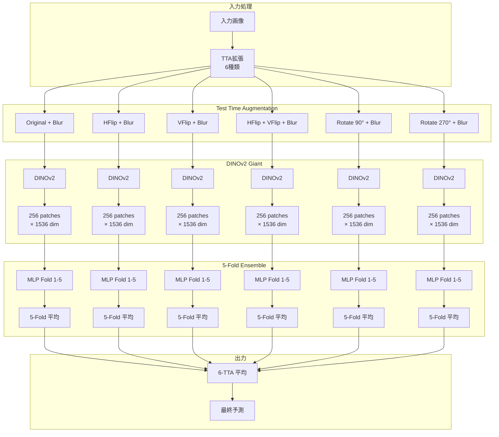
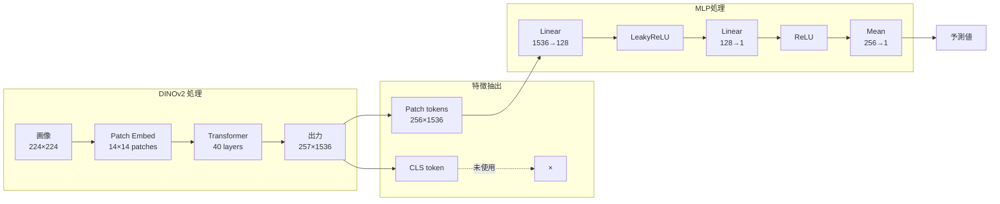

# LB 0.66 DINOv2 Dense Features アーキテクチャ詳細解説

このドキュメントは `notebook/csiro-dinov2-dense-features-lb-0-66.ipynb` の内容を詳細に解説します。

---

## 目次

1. [概要](#概要)
2. [アーキテクチャの特徴](#アーキテクチャの特徴)
3. [全体アーキテクチャ](#全体アーキテクチャ)
4. [モデルコンポーネント詳細](#モデルコンポーネント詳細)
   - [DINOv2 Giant Backbone](#dinov2-giant-backbone)
   - [BiomassMLP](#biomassmlp)
5. [アーキテクチャ図](#アーキテクチャ図)
6. [設定パラメータ](#設定パラメータ)
7. [推論パイプライン](#推論パイプライン)
8. [テンソルの流れ（具体的な次元）](#テンソルの流れ具体的な次元)
9. [他のアプローチとの比較](#他のアプローチとの比較)

---

## 概要

### モデル名

**DINOv2 Dense Features + Patch-wise MLP**

### コンセプト

従来のViTベースのアプローチでは、CLSトークンのみを使用して画像全体の特徴を表現することが一般的です。しかし、このアプローチでは**Dense Features（パッチごとの特徴ベクトル）** を活用し、各パッチに対して個別に予測を行い、それらを平均することで最終予測を得ます。

### 主要な特徴

| 特徴 | 説明 |
|------|------|
| Dense Features | CLSトークンではなく、全パッチトークンを使用 |
| Weight Sharing | 全パッチに同一のMLPを適用（パラメータ共有） |
| Patch Averaging | パッチごとの予測を平均して最終予測 |
| SAM Training | Sharpness-Aware Minimization で訓練（汎化性能向上） |
| 6-TTA | 6種類のテスト時拡張 |
| 5-Fold Ensemble | 5つのターゲット × 5フォールド = 25モデル |

### 予測対象

| ターゲット | インデックス |
|-----------|-------------|
| Dry_Clover_g | 0 |
| Dry_Dead_g | 1 |
| Dry_Green_g | 2 |
| Dry_Total_g | 3 |
| GDM_g | 4 |

---

## アーキテクチャの特徴

### Dense Features とは

ViT（Vision Transformer）は画像をパッチに分割し、各パッチをトークンとして処理します。通常、最終的な分類/回帰には**CLSトークン**（特別なトークン）のみを使用しますが、このアプローチでは**全パッチトークン**を使用します。

```
通常のアプローチ:
  [CLS, patch1, patch2, ..., patchN] → CLSのみ使用 → 予測

Dense Features アプローチ:
  [CLS, patch1, patch2, ..., patchN] → 全パッチを使用 → 各パッチで予測 → 平均
```

### メリット

1. **空間情報の保持**: 各パッチの位置情報を活用
2. **局所的な特徴の活用**: 画像内の特定領域の特徴を個別に処理
3. **ロバスト性**: 複数パッチの予測を平均するため、外れ値の影響を軽減
4. **解釈可能性**: パッチごとの予測値を可視化可能（潜在的）

---

## 全体アーキテクチャ

```
入力画像 (H × W × 3)
        │
        ▼
┌──────────────────┐
│ Resize (224×224) │
│ Normalize        │
│ GaussianBlur(5)  │  ← TTA: 6種類の拡張
└────────┬─────────┘
         │
         ▼
┌─────────────────────────────────────────────────────────┐
│                    DINOv2 Giant                         │
│                                                         │
│  入力: (B, 3, 224, 224)                                 │
│                                                         │
│  ┌─────────────────────────────────────────────────┐   │
│  │ Patch Embedding (14×14 patches)                 │   │
│  │ → 256 patches (16×16 grid)                      │   │
│  └─────────────────────────────────────────────────┘   │
│                      │                                  │
│                      ▼                                  │
│  ┌─────────────────────────────────────────────────┐   │
│  │ Transformer Encoder (40 layers)                 │   │
│  │ → last_hidden_state: (B, 257, 1536)             │   │
│  └─────────────────────────────────────────────────┘   │
│                      │                                  │
│                      ▼                                  │
│  CLS除去: last_hidden_state[:, 1:, :]                  │
│  → patch_features: (B, 256, 1536)                      │
│                                                         │
└─────────────────────────────────────────────────────────┘
         │
         ▼
┌─────────────────────────────────────────────────────────┐
│                    BiomassMLP                           │
│                 (Weight Sharing)                        │
│                                                         │
│  入力: patch_features (B, 256, 1536)                   │
│                                                         │
│  ┌─────────────────────────────────────────────────┐   │
│  │ Linear(1536 → 128)                              │   │
│  │ LeakyReLU                                       │   │
│  │ Linear(128 → 1)                                 │   │
│  └─────────────────────────────────────────────────┘   │
│                      │                                  │
│                      ▼                                  │
│  patch_predictions: (B, 256, 1)                        │
│                      │                                  │
│                      ▼                                  │
│  ReLU → Mean over patches                              │
│  → prediction: (B,)                                     │
│                                                         │
└─────────────────────────────────────────────────────────┘
         │
         ▼
    最終予測値
```

---

## モデルコンポーネント詳細

### DINOv2 Giant Backbone

**使用モデル**: `facebook/dinov2-giant` (Hugging Face Transformers)

| パラメータ | 値 |
|-----------|-----|
| モデル名 | dinov2-giant |
| パッチサイズ | 14×14 |
| 入力解像度 | 224×224 |
| パッチ数 | 256 (16×16 grid) |
| 隠れ層次元 | 1536 |
| Transformer層数 | 40 |
| パラメータ数 | ~1.1B |

**出力形式**:
```python
# last_hidden_state の形状
# (batch_size, num_patches + 1, hidden_dim)
# = (B, 257, 1536)

# CLS トークンを除いたパッチ特徴
patch_features = last_hidden_state[:, 1:, :]  # (B, 256, 1536)
```

### BiomassMLP

パッチごとの特徴を予測値に変換するシンプルなMLP。

```python
class BiomassMLP(nn.Module):
    def __init__(self, input_size, hidden_size=512, dropout_rate=0.3):
        super(BiomassMLP, self).__init__()
        self.network = nn.Sequential(
            nn.Linear(input_size, hidden_size // 4),  # 1536 → 128
            nn.LeakyReLU(),
            nn.Linear(hidden_size // 4, 1)            # 128 → 1
        )

    def forward(self, x):
        # x: (B, num_patches, hidden_dim) = (B, 256, 1536)
        patch_preds = self.network(x)  # (B, 256, 1)
        # ReLU で非負制約 + パッチ平均
        return torch.mean(torch.relu(patch_preds), dim=(1, 2))  # (B,)
```

**構造図**:

```
パッチ特徴 (256, 1536)
        │
        ▼
┌───────────────┐
│ Linear        │
│ 1536 → 128    │
└───────┬───────┘
        │
        ▼
┌───────────────┐
│ LeakyReLU     │
└───────┬───────┘
        │
        ▼
┌───────────────┐
│ Linear        │
│ 128 → 1       │
└───────┬───────┘
        │
        ▼
パッチ予測 (256, 1)
        │
        ▼
┌───────────────┐
│ ReLU          │
│ (非負制約)    │
└───────┬───────┘
        │
        ▼
┌───────────────┐
│ Mean          │
│ (パッチ平均)  │
└───────┬───────┘
        │
        ▼
最終予測 (scalar)
```

---

## アーキテクチャ図

### 高レベルフロー（Mermaid）



### Dense Features の処理フロー



### パッチの空間配置

```
224×224 画像 → 14×14 パッチ → 16×16 = 256 パッチ

┌───┬───┬───┬───┬───┬───┬───┬───┬───┬───┬───┬───┬───┬───┬───┬───┐
│ 0 │ 1 │ 2 │ 3 │ 4 │ 5 │ 6 │ 7 │ 8 │ 9 │10 │11 │12 │13 │14 │15 │
├───┼───┼───┼───┼───┼───┼───┼───┼───┼───┼───┼───┼───┼───┼───┼───┤
│16 │17 │18 │19 │20 │21 │22 │23 │24 │25 │26 │27 │28 │29 │30 │31 │
├───┼───┼───┼───┼───┼───┼───┼───┼───┼───┼───┼───┼───┼───┼───┼───┤
│32 │   │   │   │   │   │   │   │   │   │   │   │   │   │   │47 │
├───┼───┼───┼───┼───┼───┼───┼───┼───┼───┼───┼───┼───┼───┼───┼───┤
│   │   │   │   │   │   │   │   │   │   │   │   │   │   │   │   │
│   │   │   │   │     ... (16×16 = 256 patches)        │   │   │
│   │   │   │   │   │   │   │   │   │   │   │   │   │   │   │   │
├───┼───┼───┼───┼───┼───┼───┼───┼───┼───┼───┼───┼───┼───┼───┼───┤
│   │   │   │   │   │   │   │   │   │   │   │   │   │   │   │   │
├───┼───┼───┼───┼───┼───┼───┼───┼───┼───┼───┼───┼───┼───┼───┼───┤
│240│241│242│243│244│245│246│247│248│249│250│251│252│253│254│255│
└───┴───┴───┴───┴───┴───┴───┴───┴───┴───┴───┴───┴───┴───┴───┴───┘

各パッチ: 14×14 ピクセル
各パッチの特徴: 1536次元ベクトル
```

---

## 設定パラメータ

### DINOv2 設定

| パラメータ | 値 |
|-----------|-----|
| モデル | dinov2-giant |
| 入力解像度 | 224×224 |
| パッチサイズ | 14×14 |
| パッチ数 | 256 |
| 隠れ層次元 | 1536 |

### MLP 設定

| パラメータ | 値 |
|-----------|-----|
| input_size | 1536 |
| hidden_size | 512 |
| hidden_size // 4 | 128 |
| dropout_rate | 0.3 (未使用) |
| 活性化関数 | LeakyReLU |
| 出力活性化 | ReLU (非負制約) |

### 正規化パラメータ

```python
mean = [0.485, 0.456, 0.406]  # ImageNet mean
std = [0.229, 0.224, 0.225]   # ImageNet std
```

### TTA 設定

| インデックス | 変換 |
|-------------|------|
| 0 | Original + GaussianBlur(5) |
| 1 | HorizontalFlip + GaussianBlur(5) |
| 2 | VerticalFlip + GaussianBlur(5) |
| 3 | HFlip + VFlip + GaussianBlur(5) |
| 4 | Rotation(90°) + GaussianBlur(5) |
| 5 | Rotation(270°) + GaussianBlur(5) |

### 訓練設定（ノートブック外）

| パラメータ | 値 |
|-----------|-----|
| Optimizer | SAM (Sharpness-Aware Minimization) |
| Folds | 5 |
| ターゲット数 | 5 |
| 合計モデル数 | 25 (5 targets × 5 folds) |

---

## 推論パイプライン

### フロー図

```
┌─────────────────────────────────────────────────────────────────────┐
│                       推論パイプライン                               │
├─────────────────────────────────────────────────────────────────────┤
│                                                                     │
│  1. 特徴抽出（全画像に対して事前計算）                               │
│     ┌─────────────────────────────────────────────────────────┐    │
│     │ for image in test_images:                                │    │
│     │     embeddings = []                                      │    │
│     │     for aug in 6_augmentations:                          │    │
│     │         x = aug(image)                                   │    │
│     │         feat = DINOv2(x).last_hidden_state[:, 1:, :]    │    │
│     │         embeddings.append(feat)                          │    │
│     │     test_embeds[image_id] = stack(embeddings)           │    │
│     │     # shape: (6, 256, 1536)                              │    │
│     └─────────────────────────────────────────────────────────┘    │
│                                                                     │
│  2. 予測（各ターゲット × 各フォールド）                             │
│     ┌─────────────────────────────────────────────────────────┐    │
│     │ for sample in test_df:                                   │    │
│     │     target_idx = mapping[sample.target_name]             │    │
│     │     models = regressors[target_idx]  # 5 fold models    │    │
│     │     X = test_embeds[sample.image_id]  # (6, 256, 1536)  │    │
│     │                                                          │    │
│     │     prediction = 0.0                                     │    │
│     │     for fold_model in models:                            │    │
│     │         pred = mean(relu(fold_model(X)))                │    │
│     │         prediction += pred                               │    │
│     │     prediction /= 5  # fold average                     │    │
│     │     predictions.append(prediction)                       │    │
│     └─────────────────────────────────────────────────────────┘    │
│                                                                     │
└─────────────────────────────────────────────────────────────────────┘
```

### アンサンブル構造

```
                    入力画像
                       │
    ┌──────────────────┼──────────────────┐
    │         TTA: 6種類の拡張            │
    ▼          ▼          ▼          ▼          ▼          ▼
   Aug0      Aug1      Aug2      Aug3      Aug4      Aug5
    │          │          │          │          │          │
    ▼          ▼          ▼          ▼          ▼          ▼
┌───────┐  ┌───────┐  ┌───────┐  ┌───────┐  ┌───────┐  ┌───────┐
│DINOv2 │  │DINOv2 │  │DINOv2 │  │DINOv2 │  │DINOv2 │  │DINOv2 │
│(共有) │  │(共有) │  │(共有) │  │(共有) │  │(共有) │  │(共有) │
└───┬───┘  └───┬───┘  └───┬───┘  └───┬───┘  └───┬───┘  └───┬───┘
    │          │          │          │          │          │
    └──────────┴──────────┴─────┬────┴──────────┴──────────┘
                                │
                    (6, 256, 1536) stacked embeddings
                                │
    ┌───────────────────────────┼───────────────────────────┐
    │                           │                           │
    ▼                           ▼                           ▼
 Target 0                    Target 1                   ... Target 4
(Dry_Clover)                (Dry_Dead)                     (GDM)
    │                           │                           │
 ┌──┴──┐                    ┌──┴──┐                     ┌──┴──┐
 │Fold │                    │Fold │                     │Fold │
 │0-4  │                    │0-4  │                     │0-4  │
 └──┬──┘                    └──┬──┘                     └──┬──┘
    │                           │                           │
 5-fold平均                  5-fold平均                  5-fold平均
    │                           │                           │
    ▼                           ▼                           ▼
 予測値                       予測値                       予測値
```

---

## テンソルの流れ（具体的な次元）

### 入力から最終出力まで

| ステップ | テンソル形状 | 説明 |
|----------|-------------|------|
| 入力画像 | (H, W, 3) | 元画像 |
| Resize後 | (224, 224, 3) | DINOv2入力サイズ |
| ToTensor後 | (3, 224, 224) | PyTorchテンソル |
| バッチ化 | (1, 3, 224, 224) | バッチ次元追加 |
| DINOv2出力 | (1, 257, 1536) | CLS + 256パッチ |
| CLS除去後 | (1, 256, 1536) | パッチトークンのみ |
| TTA結合後 | (6, 256, 1536) | 6種類の拡張 |
| Linear 1 後 | (6, 256, 128) | 次元削減 |
| Linear 2 後 | (6, 256, 1) | パッチごとの予測 |
| ReLU後 | (6, 256, 1) | 非負制約 |
| Mean後 | (6,) | 各TTAの予測 |
| 5-fold平均後 | scalar | 最終予測 |

---

## 他のアプローチとの比較

### CrossPVT_T2T_MambaDINO との比較

| 特徴 | Dense Features | CrossPVT_T2T_MambaDINO |
|------|---------------|------------------------|
| **Backbone** | DINOv2 Giant (1.1B) | DINOv2 Base (86M) |
| **入力解像度** | 224×224 | 518×518 |
| **特徴抽出** | 全パッチ → MLP | タイル → 複雑な融合 |
| **ヘッド** | シンプルMLP | 複数ヘッド + ゲーティング |
| **TTA数** | 6 | 3 |
| **複雑さ** | 低 | 高 |
| **解釈可能性** | パッチごと可視化可能 | 複雑 |

### メリット・デメリット

**Dense Features アプローチ**:
- メリット:
  - シンプルなアーキテクチャ
  - 大規模なDINOv2モデルの恩恵
  - パッチごとの予測で解釈可能性向上の可能性
- デメリット:
  - 低解像度入力（224×224）
  - 空間的な関係性の明示的なモデリングなし

**CrossPVT_T2T_MambaDINO アプローチ**:
- メリット:
  - 高解像度入力（518×518）
  - マルチスケール処理
  - 複雑な空間関係のモデリング
- デメリット:
  - 複雑なアーキテクチャ
  - デバッグ・解析が困難

---

## 補足: コード構造

```
notebook/csiro-dinov2-dense-features-lb-0-66.ipynb
│
├── インポート・設定
│   ├── ライブラリインポート
│   └── 正規化パラメータ (mean, std)
│
├── DINOv2 Backbone
│   └── Dinov2Model.from_pretrained('dinov2-giant')
│
├── BiomassMLP
│   └── 2層MLP + ReLU + Mean
│
├── 推論
│   ├── 特徴抽出 (6-TTA)
│   ├── モデルロード (5 targets × 5 folds)
│   └── アンサンブル予測
│
└── 提出ファイル生成
    └── submission.csv
```

---

## 参考: SAM (Sharpness-Aware Minimization)

訓練時に使用されているSAMは、損失関数の「鋭さ」を最小化することで汎化性能を向上させる手法です。

```
通常の最適化:
  min_w L(w)  ← 損失を最小化

SAM:
  min_w max_{||ε||≤ρ} L(w + ε)  ← 周辺での最悪ケースを最小化
```

これにより、平坦な最小値に収束しやすくなり、過学習を防ぎます。

参考: https://github.com/davda54/sam
